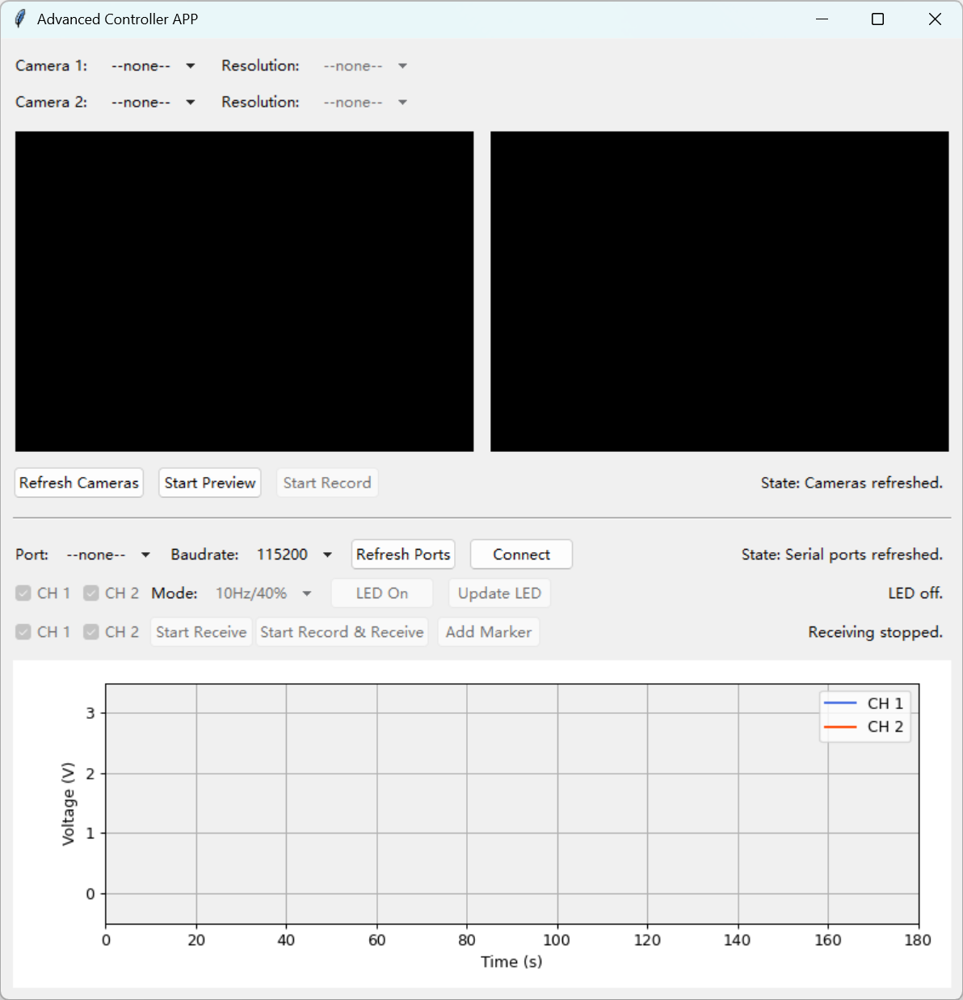

## Advanced-Controller-APP

<p align="center">
  
</p>

`Advanced Controller APP` is a desktop application built with Python and Tkinter, designed for scenarios that require simultaneous control and data acquisition from multiple cameras and serial devices. It features a GUI for real-time video previewing, video recording, sending control commands, and live-plotting/logging of signal data from external hardware.

<p align="center">
  
</p>

## Core Features

- **Dual Camera Control**:
  - Automatically scans and lists available cameras.
  - Allows independent selection of resolutions for each camera.
  - Provides a real-time preview of up to two video streams.

- **Multi-threaded Video Recording**:
  - Records video streams into local `.avi` files.
  - The recording process runs in a separate thread to ensure a smooth, non-blocking GUI experience.

- **Serial Device Communication**:
  - Automatically scans and lists available serial ports (COM ports).
  - Supports connection with a custom baud rate.
  - Sends predefined control commands to hardware via the GUI (e.g., controlling LED modes).

- **Real-time Data Plotting & Logging**:
  - Receives data from serial devices and plots waveforms in real-time using Matplotlib.
  - The plot features dynamic axis scaling to always display the most recent data window.
  - Allows inserting "Markers" into the data stream for easier post-analysis.
  - Saves the received signal data, along with timestamps and markers, into `.csv` files.

- **Synchronized Recording**:
  - A one-click "Synchronized Recording" feature starts (or stops) both video recording and serial data logging simultaneously, ensuring temporal alignment of the data.

- **Modular and Robust Architecture**:
  - Employs a design pattern similar to MVC (Model-View-Controller), clearly separating business logic (`AppController`), the user interface (`AppGUI`), and underlying services (`CameraManager`, `SerialManager`, etc.).
  - Makes extensive use of multi-threading for time-consuming tasks (camera/port scanning, video writing, serial data reading) to maintain a highly responsive UI.

## Project Structure

The project is organized into several modules, each responsible for a specific function:

- `main.py`: The application's entry point.
- `app_controller.py`: The core controller, containing all business logic and state management.
- `gui_view.py`: Defines all Tkinter GUI components and their layout.
- `camera_manager.py`: Handles scanning and managing cameras and their resolutions.
- `video_recorder.py`: A standalone class for efficiently recording video in a background thread.
- `serial_manager.py`: Manages serial port connections, data reading, and writing.
- `plot_manager.py`: Manages the Matplotlib real-time plot embedded in the GUI.

## Dependencies

To run this project, you will need to install the following Python libraries:

- **opencv-python**: For camera operations.
- **pyserial**: For serial communication.
- **matplotlib**: For data plotting.
- **numpy**: A dependency for Matplotlib, also used for data handling.

You can install them via pip:
```bash
pip install opencv-python pyserial matplotlib numpy
